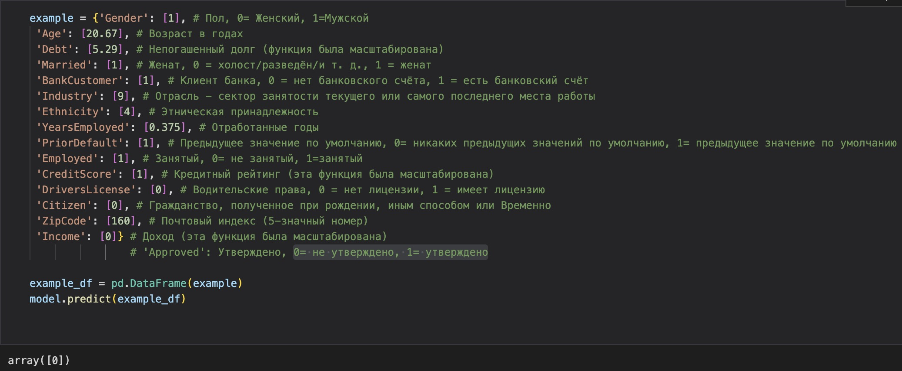
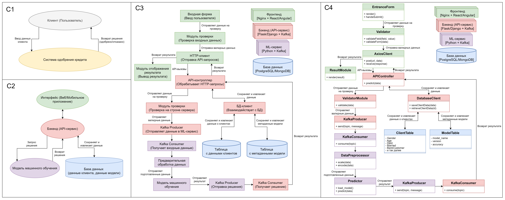
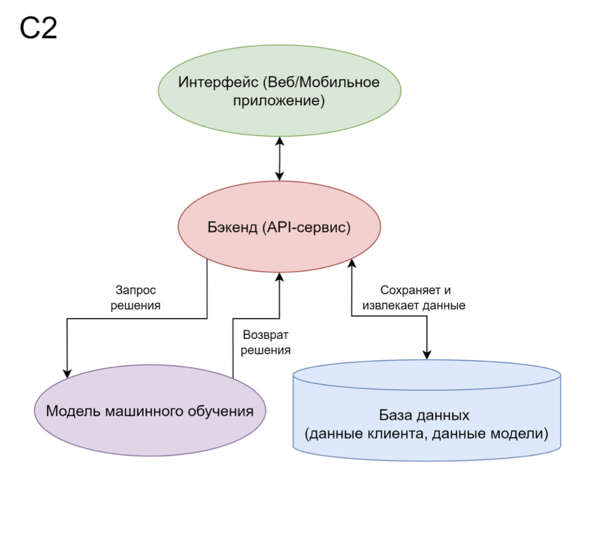
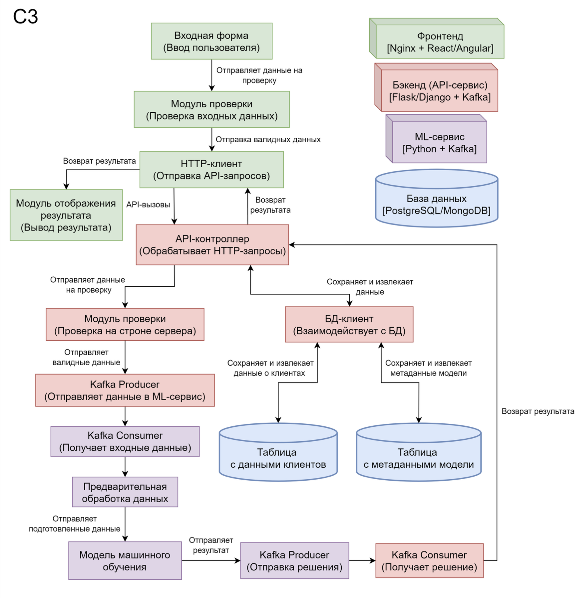
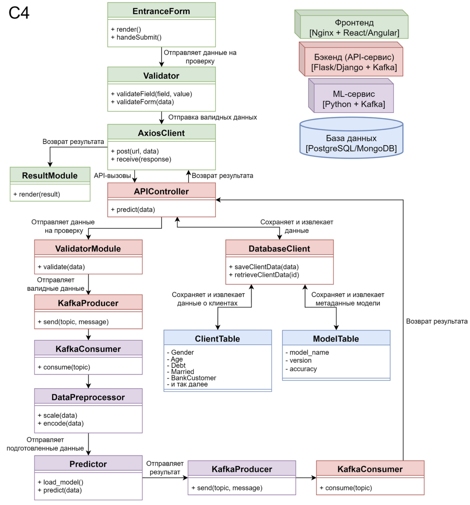

## Название  
  
Прогнозирование одобрения кредитной карты клиенту банка 

## Описание  

Прогнозирование одобрения кредитной карты клиенту банка на основании данных о клиенте (возраст, семейное положение, текущая задолженность по кредитам, отрасль в которой работает и тд).

## Бизнес-цель проекта
 
1. Увеличить процент одобрения кредитных карт для клиентов, соответствующих критериям кредитоспособности, используя модель машинного обучения для анализа данных о клиентах и предсказания вероятности одобрения. 
2. Сократить выдачу кредитных карт неплатежеспособным заемщикам.

## ML-цель проекта  

Проект направлен на решение задачи бинарной классификации, где модель машинного обучения предсказывает, относится ли клиент к категории:
1. "Кредит одобрен" (1)
2. "Кредит не одобрен" (0)

Задача классификации используется для определения вероятности того, что клиент соответствует критериям кредитоспособности, основываясь на его входных характеристиках (возраст, задолженность, семейное положение и т.д.).

Целью классификации в данном случае является:  
1. Максимизация точности предсказания одобрения кредитных карт для подходящих клиентов.  
2. Минимизация ошибок (ложных положительных и ложных отрицательных), чтобы сократить риск выдачи кредитов неплатежеспособным клиентам.

# Формулировка МЛ задачи
Прогнозирование одобрения кредита — задача, требующая настройки системы, способной оценивать вероятность одобрения на основе предоставленных данных клиента. Клиенты ценят справедливое, точное и быстрое принятие решений. Для этого важно определить цель модели, выбрать подходящий метод и построить систему, учитывающую как финансовые, так и поведенческие признаки. Рассмотрим возможные цели и подходы.

Определение цели МО
Рассмотрим три возможные цели для нашей модели:
Максимизация количества одобренных кредитов с минимальным уровнем невыплат.
Минимизация риска одобрения заведомо неплатежеспособных заявок.
Балансировка между одобрением большего числа заявок и минимизацией финансовых рисков.

Вариант 1: Максимизация количества одобренных кредитов
Цель — максимизировать количество положительных решений для заявок на кредит, минимизируя отказы.
Преимущества:
Лояльность клиентов благодаря высокой доле одобрений.
Увеличение клиентской базы и доходов банка.
Недостатки:
Риск увеличения доли невыплат, если критерии одобрения станут слишком мягкими.

Вариант 2: Минимизация рисков одобрения заведомо неплатежеспособных заявок
Цель — максимально снизить вероятность одобрения заявок, которые могут привести к невозврату кредита.
Преимущества:
Снижение финансовых убытков банка.
Более точное управление кредитными портфелями.
Недостатки:
Высокая доля отказов может негативно повлиять на репутацию и сократить клиентскую базу.

Вариант 3: Балансировка между одобрением и минимизацией рисков
Этот подход сочетает оба критерия, назначая каждому из них свой вес в зависимости от стратегических приоритетов банка.
Преимущества:
Оптимизация кредитного портфеля за счёт учёта как доходов, так и рисков.
Гибкость в настройке системы под изменения бизнес-целей.

Пример весов (таблица)
Критерий
Вес
Вероятность невыплат
   0.7
Уровень дохода клиента
   0.2
Стабильность платежей
   0.1

Вывод: Какой вариант выбрать? 🤔
Мы выбираем комбинированный подход (Вариант 3), так как он позволяет учитывать риски и одновременно удовлетворять запросы клиентов. Такой подход лучше всего соответствует долгосрочным бизнес-целям банка.

Определение входных и выходных данных системы
Как показано на схеме ниже, модель принимает на вход данные о клиенте и возвращает вероятность одобрения заявки:

Выбор категории МО
Для предсказания одобрения кредита используется метод обучения с учителем (Supervised Learning). Этот подход позволяет классифицировать заявки на основе признаков клиента.

Как работает система?
Сбор данных о клиентах. Информация, включая кредитную историю, уровень дохода, возраст и статус занятости, подготавливается к анализу.
Обучение модели. Используется алгоритм, такой как GradientBoostingClassifier, на исторических данных, содержащих как одобренные, так и отклонённые заявки.
Прогнозирование. На основе новых данных клиента модель оценивает вероятность одобрения кредита.
Пример работы модели:

Заключение и рекомендации ✅
Для успешной реализации модели прогнозирования одобрения кредита необходимо:
Использовать комбинированный подход к анализу данных (учитывать как риски невыплат, так и потребности клиентов).
Настроить веса признаков в зависимости от их влияния на качество прогнозов.
Применять методы классификации для точного предсказания вероятности одобрения.
Проводить регулярное обновление модели для повышения её точности в условиях изменения рынка.

 ## Архитектура (схема C4)

## Обоснование архитектуры  

Архитектура проекта основана на клиент-серверной модели. Модель машинного обучения разрабатывается и обучается на языке программирования Python с использованием библиотеки Scikit-learn, средства которой позволяют быстро разработать модель. Для предсказания одобрения кредита выбрана модель случайного леса, как она хорошо справляется с несбалансированными данными и собеспечивает высокую точность результатов.  

Данные клиента обрабатываются в три этапа: сбор, предобработка (масштабирование и кодирование категориальных признаков) и хранение в PostgreSQL. Такой выбор обусловлен необходимостью долговременного хранения и возможности выполнения сложных аналитических запросов. REST API реализован с помощью Flask, что позволяет легко интегрировать модель в какую-либо существующую инфраструктуру.

## Обоснование архитектуры проекта (по схеме C4)  

 

1. **Уровень C1: общий обзор системы**

На этом уровне описывается взаимодействие пользователя (клиента) с системой одобрения кредитов:  

Клиент (пользователь) вводит данные через интерфейс (например, веб-приложение или мобильное приложение).  
Система одобрения кредита обрабатывает эти данные и возвращает решение: одобрить кредит или отказать.  

 

2. **Уровень C2: контекст основных компонентов**

Этот уровень показывает разбиение системы на ключевые компоненты:  

a) Интерфейс (веб или мобильное приложение) собирает данные от клиента и направляет их в бэкенд. Интерфейс отвечает за удобство пользователя, позволяя легко вводить данные. 

b) Бэкенд (API-сервис) выполняет обработку данных, взаимодействует с базой данных и вызывает модель машинного обучения. Бэкенд обеспечивает централизованную обработку запросов, что делает систему масштабируемой и удобной для интеграции.  

c) Модель машинного обучения принимает входные данные, делает предсказание (0 или 1) и возвращает результат. Модель ML встроена как отдельный компонент, что позволяет легко обновлять или заменять её в будущем.  

d) База данных хранит данные клиентов и метаинформацию о модели. База данных необходима для хранения информации о клиентах и модели, что обеспечивает устойчивость и повторяемость процесса.  

 

3. **Уровень C3: взаимодействие модулей**

Этот уровень детализирует взаимодействие между компонентами:

Frontend (интерфейс) вводит данные через форму (например, с использованием React/Angular) и передаёт данные через API-запросы (AxiosClient).  

API-контроллер (бэкенд) получает запросы, проверяет данные (модуль валидации), отправляет валидные данные через Kafka в ML-сервис.  

ML-сервис выполняет предобработку данных (DataPreprocessor), делает предсказание (Predictor) и отправляет результат обратно. 

База данных хранит клиентские данные (ClientTable) и метаинформацию о модели (ModelTable).

 

Использование Kafka для передачи данных между бэкендом и ML-сервисом делает систему асинхронной и устойчивой к нагрузкам. Модульная структура (валидация, предобработка, предсказание) упрощает поддержку и масштабирование. Хранение метаданных модели в отдельной таблице позволяет отслеживать версию модели и её точность.

## Обоснование выбора используемого стека  

1. **Фронтенд - ввод и отображение данных**
  
Фреймворки React или Angular — для создания динамичного пользовательского интерфейса, обеспечивающего интерактивность и отзывчивость приложения.

Библиотека Axios: для отправки HTTP-запросов (GET/POST) с клиентской стороны на сервер.

Веб-сервер Nginx — для хостинга фронтенд-приложения и обработки статических файлов.

2. **Бэкенд - обработка данных и взаимодействие с другими сервисами**

Язык программирования Python используется благодаря своей простоте и большому количеству библиотек для интеграции с ML-моделями и работы с данными.

Фреймворк для создания REST API - Flask — лёгкий и масштабируемый фреймворк для обработки HTTP-запросов и построения API.

Асинхронные сообщения - Kafka (Apache Kafka) для передачи данных между компонентами (например, от API к ML-сервису). Kafka обеспечивает надёжную асинхронную коммуникацию и масштабируемость.

3. **Машинное обучение (ML-сервис)**

Язык программирования: Python — основной язык для разработки ML-сервиса.
Scikit-learn: библиотека для разработки, обучения и тестирования моделей машинного обучения. В данном проекте используется модель случайного леса (Random Forest).

Обработка данных: Pandas для работы с табличными данными, NumPy: для вычислений и работы с числовыми данными, Kafka (в ML-сервисе) для приёма входных данных и отправки предсказаний обратно в API.

4. **База данных - хранение данных клиентов и метаинформации**

База данных: PostgreSQL - реляционная база данных для хранения клиентских данных (таблица ClientTable) и метаинформации о модели (таблица ModelTable). MongoDB (опционально) может использоваться для неструктурированных данных, если проект предполагает хранение дополнительной информации (например, логов).

5. **Системные компоненты**
 
Docker - для контейнеризации всех компонентов проекта (фронтенд, бэкенд, ML-сервис, Kafka, база данных). Это упрощает развертывание и переносимость системы.  
Kubernetes (опционально) - для оркестрации контейнеров в случае масштабирования системы.

6. **Дополнительно**

Prometheus/Grafana для мониторинга производительности системы.  
ELK-стек (Elasticsearch, Logstash, Kibana) для хранения и анализа логов.

## Описание сетей (DMZ, Secure zone и т.д.)  

1. **DMZ (Demilitarized Zone)** предназначена для минимизации риска атаки на внутреннюю сеть. Здесь располагается Frontend (Nginx/React/Angular) и API шлюз. Содержит компоненты, которые должны быть доступны из интернета.

2.	**Secure Zone (зона безопасности)** предназначена ля обработки данных, которые уже прошли первичную валидацию. Здесь располагаются Backend API и Validation Logic. Также здесь находится компонент, отправляющий данные в Kafka.

3.	**Internal Zone (внутренняя зона)** предназначена для компонентов, обеспечивающих хранение данных и выполнение машинного обучения. Здесь находятся: база данных (PostgreSQL/MongoDB), Kafka Cluster, ML Service.

4.	**Monitoring & Management Zone (зона мониторинга)** - изолированная зона для управления и мониторинга всей инфраструктуры. Размещает инструменты мониторинга, такие как Prometheus, Grafana, а также Kafka UI или Kibana для анализа логов.
