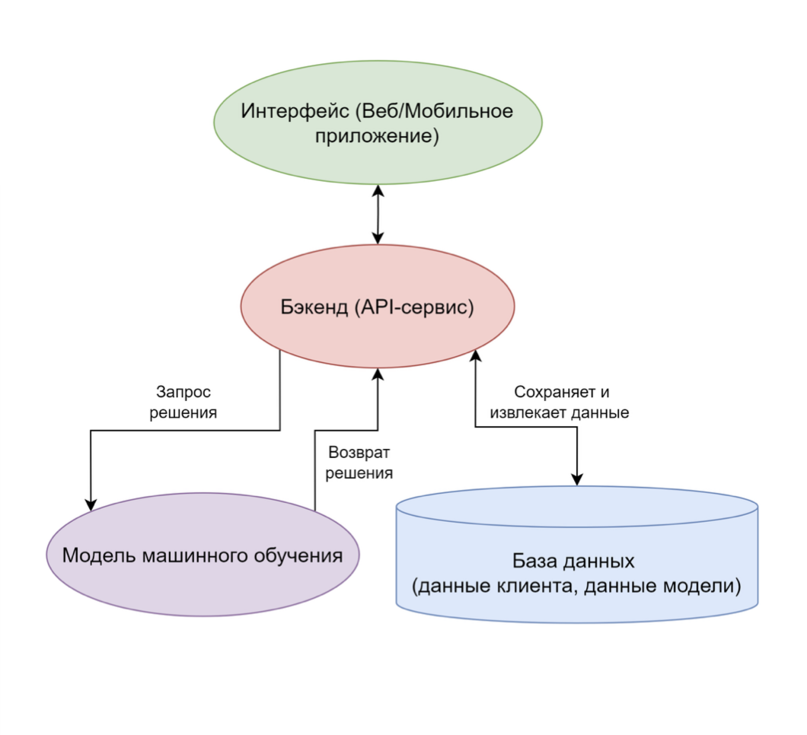
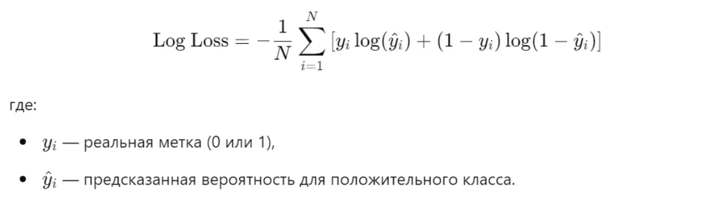
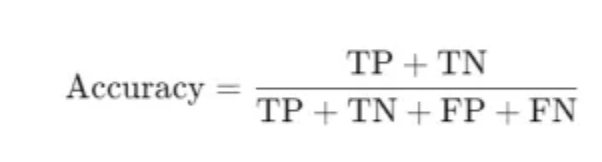

## Название  
  
Прогнозирование одобрения кредитной карты клиенту банка 

## Описание  

Прогнозирование одобрения кредитной карты клиенту банка на основании данных о клиенте (возраст, семейное положение, текущая задолженность по кредитам, отрасль в которой работает и тд).

## Бизнес-цель проекта
 
1. Увеличить процент одобрения кредитных карт для клиентов, соответствующих критериям кредитоспособности, используя модель машинного обучения для анализа данных о клиентах и предсказания вероятности одобрения. 
2. Сократить выдачу кредитных карт неплатежеспособным заемщикам.

## ML-цель проекта  

Проект направлен на решение задачи бинарной классификации, где модель машинного обучения предсказывает, относится ли клиент к категории:
1. "Кредит одобрен" (1)
2. "Кредит не одобрен" (0)

Задача классификации используется для определения вероятности того, что клиент соответствует критериям кредитоспособности, основываясь на его входных характеристиках (возраст, задолженность, семейное положение и т.д.).

Целью классификации в данном случае является:  
1. Максимизация точности предсказания одобрения кредитных карт для подходящих клиентов.  
2. Минимизация ошибок (ложных положительных и ложных отрицательных), чтобы сократить риск выдачи кредитов неплатежеспособным клиентам.

## Формулировка МЛ задачи
Прогнозирование одобрения кредита — задача, требующая настройки системы, способной оценивать вероятность одобрения на основе предоставленных данных клиента. Клиенты ценят справедливое, точное и быстрое принятие решений. Для этого важно определить цель модели, выбрать подходящий метод и построить систему, учитывающую как финансовые, так и поведенческие признаки. Рассмотрим возможные цели и подходы.

**Определение цели МО.**
Рассмотрим три возможные цели для нашей модели:
Максимизация количества одобренных кредитов с минимальным уровнем невыплат.
Минимизация риска одобрения заведомо неплатежеспособных заявок.
Балансировка между одобрением большего числа заявок и минимизацией финансовых рисков.

*Вариант 1: Максимизация количества одобренных кредитов*
Цель — максимизировать количество положительных решений для заявок на кредит, минимизируя отказы.
Преимущества:
Лояльность клиентов благодаря высокой доле одобрений.
Увеличение клиентской базы и доходов банка.
Недостатки:
Риск увеличения доли невыплат, если критерии одобрения станут слишком мягкими.

*Вариант 2: Минимизация рисков одобрения заведомо неплатежеспособных заявок*
Цель — максимально снизить вероятность одобрения заявок, которые могут привести к невозврату кредита.
Преимущества:
Снижение финансовых убытков банка.
Более точное управление кредитными портфелями.
Недостатки:
Высокая доля отказов может негативно повлиять на репутацию и сократить клиентскую базу.

*Вариант 3: Балансировка между одобрением и минимизацией рисков*
Этот подход сочетает оба критерия, назначая каждому из них свой вес в зависимости от стратегических приоритетов банка.
Преимущества:
Оптимизация кредитного портфеля за счёт учёта как доходов, так и рисков.
Гибкость в настройке системы под изменения бизнес-целей.

**Пример весов (таблица).**
Критерий
Вес
Вероятность невыплат
   0.7
Уровень дохода клиента
   0.2
Стабильность платежей
   0.1

**Вывод.**
Мы выбираем комбинированный подход (вариант 3), так как он позволяет учитывать риски и одновременно удовлетворять запросы клиентов. Такой подход лучше всего соответствует долгосрочным бизнес-целям банка.

**Определение входных и выходных данных системы.**
Как показано на схеме ниже, модель принимает на вход данные о клиенте и возвращает вероятность одобрения заявки:

**Выбор категории МО.**
Для предсказания одобрения кредита используется метод обучения с учителем (Supervised Learning). Этот подход позволяет классифицировать заявки на основе признаков клиента.

**Как работает система.**
Сбор данных о клиентах. Информация, включая кредитную историю, уровень дохода, возраст и статус занятости, подготавливается к анализу.
Обучение модели. Используется алгоритм, такой как GradientBoostingClassifier, на исторических данных, содержащих как одобренные, так и отклонённые заявки.
Прогнозирование. На основе новых данных клиента модель оценивает вероятность одобрения кредита.
Пример работы модели:

**Заключение и рекомендации.**
Для успешной реализации модели прогнозирования одобрения кредита необходимо:
Использовать комбинированный подход к анализу данных (учитывать как риски невыплат, так и потребности клиентов).
Настроить веса признаков в зависимости от их влияния на качество прогнозов.
Применять методы классификации для точного предсказания вероятности одобрения.
Проводить регулярное обновление модели для повышения её точности в условиях изменения рынка.

## Обучение модели
Метод случайного леса (Random Forest) — это один из самых популярных алгоритмов машинного обучения. Он основан на ансамбле деревьев решений и подходит для решения задач классификации и регрессии. Рассмотрим ключевые этапы обучения модели с использованием этого метода.

**Основы метода случайного леса.**
Случайный лес строится из множества деревьев решений, каждое из которых обучается на случайной подвыборке данных. Решение всей модели формируется на основе агрегирования результатов всех деревьев (например, голосованием для классификации или усреднением для регрессии).

**Построение датасета.**
Для обучения модели случайного леса важно подготовить качественные данные.
Пример данных:
Мы используем датасет с признаками, которые будут влиять на прогнозы модели.
Для задачи классификации, например, одобрение кредита клиенту банка, можно использовать:
Возраст клиента.
Уровень дохода.
Кредитную историю (наличие просрочек, текущие кредиты).
Тип занятости.
Семейное положение.

**Обработка данных:**
Кодирование категориальных признаков. Для текстовых данных, таких как тип занятости или семейное положение, применяем one-hot или label encoding.
Масштабирование. Для числовых признаков, таких как доход или сумма кредита, нормализация не требуется, так как случайный лес нечувствителен к масштабированию данных.
Обработка пропусков. Пропуски можно заполнить медианным значением или отдельным маркером (например, "-1").

**Алгоритм обучения.**
Обучение случайного леса состоит из следующих этапов:
Создание подвыборок данных. Для каждого дерева выбирается случайная подвыборка с заменой (bagging).
Выбор случайного набора признаков. Для построения каждого узла дерева выбирается случайное подмножество признаков. Это снижает вероятность переобучения.
Построение деревьев. На каждой подвыборке строится дерево решений, которое предсказывает целевой показатель.
Агрегация результатов. Для классификации применяется правило большинства голосов (наиболее часто встречающийся класс).

**Гиперпараметры.**
Гиперпараметры по желанию можно добавить.

**Оценка модели.**
Для оценки модели случайного леса используем следующие метрики:
F1-score: Метрика, учитывающая баланс между точностью и полнотой.
ROC-AUC: Показывает качество разделения классов.
Out-of-Bag (OOB) Error: Случайный лес автоматически оценивает ошибку на тех объектах, которые не попали в подвыборку для обучения дерева.

**Преимущества метода случайного леса.**
Стабильность: Устойчив к выбросам и шуму в данных.
Неподверженность переобучению: Использование подвыборок и случайных признаков предотвращает переобучение.
Интерпретируемость: Возможность оценить значимость признаков (Feature Importance).

**Пример работы случайного леса.**
На схеме показан процесс работы модели:
Модель обучается на подвыборках, генерируя несколько деревьев решений.
Каждое дерево выдаёт прогноз.
Прогнозы агрегируются (голосование или усреднение), чтобы получить финальное предсказание.

**Заключение.**
Метод случайного леса — мощный инструмент, который показывает отличные результаты для задач классификации и регрессии. Его преимущества включают устойчивость, гибкость и способность работать с большим количеством признаков без значительной предварительной обработки данных.
Для эффективного применения случайного леса важно:
Настроить гиперпараметры (особенно количество деревьев и глубину деревьев).
Подготовить качественные данные, включая обработку пропусков и кодирование категориальных признаков.
Использовать метрики для оценки качества модели и визуализации её результатов.
Случайный лес — это надёжное решение, особенно в задачах, где важны высокая точность и устойчивость к шуму в данных.

### Оценка модели
Оценка модели — это важнейший этап в разработке системы для прогнозирования одобрения кредитной карты клиенту банка. Она позволяет измерить, насколько хорошо модель предсказывает вероятность одобрения заявки, и выявить области для её улучшения. В этом разделе мы рассмотрим ключевые метрики, которые используются для оценки модели, их интерпретацию и подходы к оптимизации.

**Метрики для оценки модели.**
Для задачи прогнозирования одобрения кредита используются несколько ключевых метрик, таких как Log Loss, F1-Score, Accuracy, и ROC-AUC. Эти метрики помогают оценить, насколько точны прогнозы модели.

*1. Log Loss (логарифмическая потеря)* измеряет, насколько хорошо модель предсказывает вероятности классов. Чем ниже значение Log Loss, тем точнее модель. Эта метрика особенно важна для задач, где требуется предсказать вероятность одобрения заявки.Формула для расчета Log Loss выглядит так:

Пример: Если модель предсказала вероятность 0.9 для одобрения кредита, и реальный результат был 1 (утверждён), метрика будет меньше наказывать модель, чем если бы вероятность была 0.1.

*2. F1-Score* — это гармоническое среднее между точностью (precision) и полнотой (recall). Эта метрика особенно полезна для задачи прогнозирования кредита, где важно минимизировать как ложные отказы (FN), так и ложные одобрения (FP).

Пример: Если модель предсказывает одобрение кредита с высокой точностью и полнотой, F1-Score будет высоким, что указывает на хороший баланс между этими двумя показателями.

*3. Accuracy* измеряет долю правильных предсказаний среди всех предсказаний. Это простой и популярный метод оценки классификационных моделей, который показывает, насколько часто модель правильно предсказывает статус заявки.

Пример: Если модель правильно классифицировала 90 из 100 заявок, Accuracy составит 90%.

*4. ROC-AUC* оценивает, насколько хорошо модель различает положительные и отрицательные классы. Это полезно в задачах, где требуется взвешенное решение для минимизации как ложноположительных, так и ложноотрицательных результатов.

Пример: Если ROC-AUC равен 0.95, это означает, что модель хорошо отличает одобренные заявки от отклонённых.

**Оперативные метрики.**
Оперативные метрики оценивают влияние модели на бизнес-процессы и качество решений, принимаемых на основе её предсказаний.

*1. Доля одобренных заявок.*
Эта метрика показывает процент заявок, которые были одобрены на основе предсказаний модели. Она помогает понять, насколько агрессивна или консервативна модель.

Пример: Если из 1000 заявок было одобрено 700, доля одобренных составляет 70%.

*2. Финансовый риск.*
Оценивается средний уровень финансовых убытков от ошибочных предсказаний (например, одобрение кредитов ненадёжным клиентам). Эта метрика используется для настройки модели так, чтобы минимизировать риск.

Пример: Если модель одобряет кредиты клиентам с высокой вероятностью невыплат, финансовый риск может быть значительным.

**Рекомендации по улучшению модели.**

*1. Учет дополнительных факторов.*
Для повышения точности предсказаний добавляются новые признаки, такие как:
История платежей.
Региональные факторы.
Поведение клиента в мобильном приложении банка.

*2. A/B тестирование.*
Проводятся A/B тесты для проверки влияния изменений модели на метрики, такие как Accuracy, F1-Score и доля одобренных заявок.

Пример: В одной группе используется текущая версия модели, а в другой — новая версия с улучшенными признаками.

*3. Оптимизация гиперпараметров.*
Используется поиск по сетке (Grid Search) или случайный поиск (Random Search) для настройки гиперпараметров модели, что позволяет повысить её производительность.

Пример: Регуляризация и настройка learning rate в градиентном бустинге для минимизации Log Loss.

**Заключение.**
Оценка модели для прогнозирования одобрения кредитных карт является ключевым этапом, который обеспечивает высокое качество предсказаний и минимизирует финансовые риски. Использование метрик, таких как Log Loss, F1-Score и ROC-AUC, помогает определить производительность модели, а рекомендации по улучшению позволяют сделать её более точной и надёжной.

 ## Архитектура (схема C4)

## Обоснование архитектуры  

Архитектура проекта основана на клиент-серверной модели. Модель машинного обучения разрабатывается и обучается на языке программирования Python с использованием библиотеки Scikit-learn, средства которой позволяют быстро разработать модель. Для предсказания одобрения кредита выбрана модель случайного леса, как она хорошо справляется с несбалансированными данными и собеспечивает высокую точность результатов.  

Данные клиента обрабатываются в три этапа: сбор, предобработка (масштабирование и кодирование категориальных признаков) и хранение в PostgreSQL. Такой выбор обусловлен необходимостью долговременного хранения и возможности выполнения сложных аналитических запросов. REST API реализован с помощью Flask, что позволяет легко интегрировать модель в какую-либо существующую инфраструктуру.

## Обоснование архитектуры проекта (по схеме C4)  

 

1. **Уровень C1: общий обзор системы**

На этом уровне описывается взаимодействие пользователя (клиента) с системой одобрения кредитов:  

Клиент (пользователь) вводит данные через интерфейс (например, веб-приложение или мобильное приложение).  
Система одобрения кредита обрабатывает эти данные и возвращает решение: одобрить кредит или отказать.  

 

2. **Уровень C2: контекст основных компонентов**

Этот уровень показывает разбиение системы на ключевые компоненты:  

a) Интерфейс (веб или мобильное приложение) собирает данные от клиента и направляет их в бэкенд. Интерфейс отвечает за удобство пользователя, позволяя легко вводить данные. 

b) Бэкенд (API-сервис) выполняет обработку данных, взаимодействует с базой данных и вызывает модель машинного обучения. Бэкенд обеспечивает централизованную обработку запросов, что делает систему масштабируемой и удобной для интеграции.  

c) Модель машинного обучения принимает входные данные, делает предсказание (0 или 1) и возвращает результат. Модель ML встроена как отдельный компонент, что позволяет легко обновлять или заменять её в будущем.  

d) База данных хранит данные клиентов и метаинформацию о модели. База данных необходима для хранения информации о клиентах и модели, что обеспечивает устойчивость и повторяемость процесса.  

 

3. **Уровень C3: взаимодействие модулей**

Этот уровень детализирует взаимодействие между компонентами:

Frontend (интерфейс) вводит данные через форму (например, с использованием React/Angular) и передаёт данные через API-запросы (AxiosClient).  

API-контроллер (бэкенд) получает запросы, проверяет данные (модуль валидации), отправляет валидные данные через Kafka в ML-сервис.  

ML-сервис выполняет предобработку данных (DataPreprocessor), делает предсказание (Predictor) и отправляет результат обратно. 

База данных хранит клиентские данные (ClientTable) и метаинформацию о модели (ModelTable).

 

Использование Kafka для передачи данных между бэкендом и ML-сервисом делает систему асинхронной и устойчивой к нагрузкам. Модульная структура (валидация, предобработка, предсказание) упрощает поддержку и масштабирование. Хранение метаданных модели в отдельной таблице позволяет отслеживать версию модели и её точность.

## Вводим эксплуатацию
После того как модель для прогнозирования одобрения кредитной карты обучена и готова к использованию, начинается этап её эксплуатации. На этом этапе система обрабатывает запросы клиентов банка, предоставляя решение о выдаче кредитной карты в режиме реального времени. В этой главе рассмотрены ключевые аспекты эксплуатации модели, включая архитектуру системы, работу предсказательного пайплайна и мониторинг её производительности.

**Общий дизайн системы прогнозирования кредита.**
Система прогнозирования одобрения кредита состоит из двух основных пайплайнов:
Пайплайн обработки данных клиента: Обеспечивает сбор и предварительную обработку данных клиента (например, возраст, кредитный рейтинг, текущая задолженность).
Предсказательный пайплайн: Использует обработанные данные для выдачи прогнозов, основываясь на обученной модели.

**Предсказательный пайплайн.**
Пайплайн прогнозирования включает два ключевых этапа:
Обработка данных клиента: Данные клиента проходят проверку, преобразуются (например, категориальные переменные кодируются) и масштабируются для совместимости с моделью.
Прогнозирование результата: Обработанные данные передаются в модель, которая возвращает вероятность одобрения. На основе порогового значения система определяет, будет ли кредит одобрен.

**Мониторинг и поддержка системы.**
Для успешной эксплуатации системы важно обеспечить её стабильность и эффективность через мониторинг ключевых метрик и регулярное обновление модели.

*3.1. Мониторинг производительности*
Технические метрики: Время отклика системы, процент ошибок в предсказаниях.
Бизнес-метрики: Доля одобренных кредитов, количество одобрений ошибочных заявок, кредитный риск (финансовый убыток от неверных решений).
💡 Пример метрики: Если время отклика системы превышает 1 секунду в 95% случаев, это может указывать на необходимость оптимизации предсказательного пайплайна.

*3.2. Обновление модели*
Периодическое обновление: Для учёта новых данных клиенты модели регулярно переобучаются.
A/B тестирование: Сравнение текущей версии модели с новыми версиями для проверки их эффективности.
💡 Пример: Проверка, приводит ли новая модель к снижению количества ложноположительных решений.

**Проблемы эксплуатации и их решения.**

*4.1. Холодный старт*
Проблема: Для новых клиентов с недостаточными данными могут возникать ошибки предсказания.
Решение: Использовать обобщённые данные (например, средние значения по сегменту клиентов).
*4.2. Обработка нестандартных данных*
Проблема: Некорректные или неполные данные могут снизить точность предсказаний.
Решение: Внедрить строгие проверки данных на этапе обработки и предложить клиенту заполнить недостающую информацию.

**5. Заключение.**
Система прогнозирования одобрения кредитных карт является многокомпонентной и состоит из модулей ввода данных, предсказания и мониторинга. Успешная эксплуатация требует эффективного управления каждым этапом.
Ключевые выводы:
Система собирает данные клиента и прогнозирует результат с использованием обученной модели.
Мониторинг метрик обеспечивает стабильность работы системы и своевременное обнаружение проблем.
Регулярное обновление модели и A/B тестирование помогают адаптироваться к новым условиям и улучшать точность прогнозов.

## Обоснование выбора используемого стека  

1. **Фронтенд - ввод и отображение данных**
  
Фреймворки React или Angular — для создания динамичного пользовательского интерфейса, обеспечивающего интерактивность и отзывчивость приложения.

Библиотека Axios: для отправки HTTP-запросов (GET/POST) с клиентской стороны на сервер.

Веб-сервер Nginx — для хостинга фронтенд-приложения и обработки статических файлов.

2. **Бэкенд - обработка данных и взаимодействие с другими сервисами**

Язык программирования Python используется благодаря своей простоте и большому количеству библиотек для интеграции с ML-моделями и работы с данными.

Фреймворк для создания REST API - Flask — лёгкий и масштабируемый фреймворк для обработки HTTP-запросов и построения API.

Асинхронные сообщения - Kafka (Apache Kafka) для передачи данных между компонентами (например, от API к ML-сервису). Kafka обеспечивает надёжную асинхронную коммуникацию и масштабируемость.

3. **Машинное обучение (ML-сервис)**

Язык программирования: Python — основной язык для разработки ML-сервиса.
Scikit-learn: библиотека для разработки, обучения и тестирования моделей машинного обучения. В данном проекте используется модель случайного леса (Random Forest).

Обработка данных: Pandas для работы с табличными данными, NumPy: для вычислений и работы с числовыми данными, Kafka (в ML-сервисе) для приёма входных данных и отправки предсказаний обратно в API.

4. **База данных - хранение данных клиентов и метаинформации**

База данных: PostgreSQL - реляционная база данных для хранения клиентских данных (таблица ClientTable) и метаинформации о модели (таблица ModelTable). MongoDB (опционально) может использоваться для неструктурированных данных, если проект предполагает хранение дополнительной информации (например, логов).

5. **Системные компоненты**
 
Docker - для контейнеризации всех компонентов проекта (фронтенд, бэкенд, ML-сервис, Kafka, база данных). Это упрощает развертывание и переносимость системы.  
Kubernetes (опционально) - для оркестрации контейнеров в случае масштабирования системы.

6. **Дополнительно**

Prometheus/Grafana для мониторинга производительности системы.  
ELK-стек (Elasticsearch, Logstash, Kibana) для хранения и анализа логов.

## Описание сетей (DMZ, Secure zone и т.д.)  

1. **DMZ (Demilitarized Zone)** предназначена для минимизации риска атаки на внутреннюю сеть. Здесь располагается Frontend (Nginx/React/Angular) и API шлюз. Содержит компоненты, которые должны быть доступны из интернета.

2.	**Secure Zone (зона безопасности)** предназначена ля обработки данных, которые уже прошли первичную валидацию. Здесь располагаются Backend API и Validation Logic. Также здесь находится компонент, отправляющий данные в Kafka.

3.	**Internal Zone (внутренняя зона)** предназначена для компонентов, обеспечивающих хранение данных и выполнение машинного обучения. Здесь находятся: база данных (PostgreSQL/MongoDB), Kafka Cluster, ML Service.

4.	**Monitoring & Management Zone (зона мониторинга)** - изолированная зона для управления и мониторинга всей инфраструктуры. Размещает инструменты мониторинга, такие как Prometheus, Grafana, а также Kafka UI или Kibana для анализа логов.
